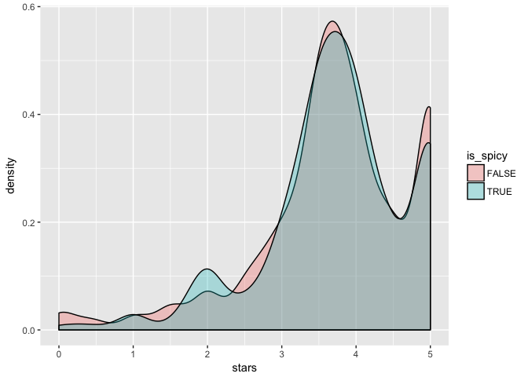

Tidy Tuesday 06-04: Ramen
================

This is a rough first attempt at a Tidy Tuesday writeup\! Starting with
June 6th,
2019:

<https://github.com/rfordatascience/tidytuesday/tree/master/data/2019/2019-06-04>

``` r
library(tidyverse)
library(tidytext)
ramen_ratings <- readr::read_csv("https://raw.githubusercontent.com/rfordatascience/tidytuesday/master/data/2019/2019-06-04/ramen_ratings.csv")
colnames(ramen_ratings)
```

    ## [1] "review_number" "brand"         "variety"       "style"        
    ## [5] "country"       "stars"

First, I used head() and summary() to get a quick sense of what this
data looks like:

``` r
head(ramen_ratings)
```

    ## # A tibble: 6 x 6
    ##   review_number brand           variety                style country stars
    ##           <int> <chr>           <chr>                  <chr> <chr>   <dbl>
    ## 1          3180 Yum Yum         Tem Tem Tom Yum Moo D… Cup   Thaila…  3.75
    ## 2          3179 Nagatanien      tom Yum Kung Rice Ver… Pack  Japan    2   
    ## 3          3178 Acecook         Kelp Broth Shio Ramen  Cup   Japan    2.5 
    ## 4          3177 Maison de Coree Ramen Gout Coco Poulet Cup   France   3.75
    ## 5          3176 Maruchan        Gotsumori Shio Yakiso… Tray  Japan    5   
    ## 6          3175 Myojo           Chukazanmai Tantanmen  Cup   Japan    3.5

``` r
summary(ramen_ratings)
```

    ##  review_number       brand             variety             style          
    ##  Min.   :   1.0   Length:3180        Length:3180        Length:3180       
    ##  1st Qu.: 795.5   Class :character   Class :character   Class :character  
    ##  Median :1590.0   Mode  :character   Mode  :character   Mode  :character  
    ##  Mean   :1590.1                                                           
    ##  3rd Qu.:2384.5                                                           
    ##  Max.   :3180.0                                                           
    ##  NA's   :1                                                                
    ##    country              stars      
    ##  Length:3180        Min.   :0.000  
    ##  Class :character   1st Qu.:3.250  
    ##  Mode  :character   Median :3.750  
    ##                     Mean   :3.688  
    ##                     3rd Qu.:4.500  
    ##                     Max.   :5.000  
    ##                     NA's   :14

The first question that jumped out at me: how do the median ratings (and
distribution of ratings) differ between countries? What is best and
worst country for ramen? A horizontal box plot seems like a good way to
get started:

``` r
ramen_ratings %>%
  ggplot(aes(x=fct_reorder(country, stars, fun=median), y=stars)) + 
    geom_boxplot() + 
    coord_flip()
```

<!-- -->

Here I noticed some strange behaviors – in particular, take a look at
the highest-ranked countries. It appears that United States is both
first-ranked and, somehow, has a lower median rating than Japan\! How is
that? After poking around, I realized that the “fun=median” parameter
passed into ggplot2’s did not identify outliers, whereas ggplot2’s
boxplot geom identifies outliers and generates the 25th-50th-75th
percentile box excluding those outliers. How could we get “fun=median”
to behave similarly?

For the time being, I proceeded to visualizing by style (and noticed the
same median ranking issue yet again\!)

``` r
ramen_ratings %>%
  ggplot(aes(x = fct_reorder(style, stars, fun=median, .desc=TRUE), y=stars)) +
        geom_boxplot(aes(fill = fct_reorder(style, stars, fun=median, .desc=TRUE))) +
        # geom_jitter(position=position_jitter(0.2)) +
        theme_bw(base_size = 14) +
        xlab("Style") +
        ylab("Ratings") +
        scale_fill_discrete(guide = guide_legend(title = "Style"))
```

    ## Warning: Removed 14 rows containing non-finite values (stat_boxplot).

<!-- --> The lack of
a box for Can made me realize, oh wait, is there only one observation
with a Can style in our dataset? Can we do some simple low-pass
filtering to get more focused data? Sure enough:

``` r
ramen_ratings %>%
  group_by(style) %>%
  count()
```

    ## # A tibble: 9 x 2
    ## # Groups:   style [9]
    ##   style          n
    ##   <chr>      <int>
    ## 1 Bar            1
    ## 2 Bowl         612
    ## 3 Box           32
    ## 4 Can            1
    ## 5 Cup          559
    ## 6 Pack        1832
    ## 7 Restaurant     3
    ## 8 Tray         138
    ## 9 <NA>           2

For simplicity’s sake, I decided to exclude Bar, Can, and Restaurant, as
well as ramen with Null Style values. I wanted to compare these newly
simplified distributions, and sure enough, take a look at the disparity
between Box and Cup ramen\!:

``` r
ramen_cleaner <- ramen_ratings %>%
  filter(style != "NA" & style != "Bar" & style != "Can" & style != "Restaurant")
  

ramen_cleaner %>%
  ggplot(aes(x = stars, fill=style)) +
        geom_density(alpha=0.3)
```

    ## Warning: Removed 14 rows containing non-finite values (stat_density).

<!-- -->

Now let’s redo box plots excluding low-count styles:

``` r
ramen_cleaner %>%
  ggplot(aes(x = fct_reorder(style, stars, fun=median, .desc=TRUE), y=stars)) +
        geom_boxplot(aes(fill = fct_reorder(style, stars, fun=median, .desc=TRUE))) +
        # geom_jitter(position=position_jitter(0.2)) +
        theme_bw(base_size = 14) +
        xlab("Style") +
        ylab("Ratings") +
        scale_fill_discrete(guide = guide_legend(title = "Style"))
```

    ## Warning: Removed 14 rows containing non-finite values (stat_boxplot).

<!-- --> \#\# Part
Two: Text Analysis

After poking around other Tidy Tuesday projects, I noticed that there
were some interesting things happening in that unstructured “brand” text
variable:

``` r
all_words_in_variety <- ramen_ratings %>%
  unnest_tokens(word, variety) %>%
  select(word)

words_sorted <- all_words_in_variety %>%
  group_by(word) %>%
  count() %>%
  arrange(desc(n))

words_sorted
```

    ## # A tibble: 1,744 x 2
    ## # Groups:   word [1,744]
    ##    word        n
    ##    <chr>   <int>
    ##  1 noodles   797
    ##  2 noodle    660
    ##  3 instant   511
    ##  4 ramen     492
    ##  5 flavour   459
    ##  6 flavor    407
    ##  7 chicken   378
    ##  8 spicy     351
    ##  9 beef      276
    ## 10 soup      260
    ## # ... with 1,734 more rows

A quick densit plot reveals that most brand words are relatively unique
across all observations:

``` r
words_sorted %>%
  ggplot(aes(x=n)) +
  geom_density()
```

<!-- -->

I decided to extract meat type (I term this “variety”). To do this, I
use the grepl() search, which checks to see if a substring exists within
a string. Combined with case\_when() and mutate(), I can generate the
appropriate value for our new “variety” variable based on the result of
these substring searches:

``` r
ramen_ratings <- ramen_ratings %>%
  mutate(variety = tolower(variety)) %>%
  mutate(meat = case_when(
    grepl("chicken", variety) ~ "chicken",
    grepl("beef", variety) ~ "beef",
    grepl("pork", variety) ~ "pork",
    grepl("shrimp", variety) ~ "shrimp",
    grepl("seafood", variety) ~ "seafood"))

ramen_ratings %>%
  group_by(meat) %>%
  count()
```

    ## # A tibble: 6 x 2
    ## # Groups:   meat [6]
    ##   meat        n
    ##   <chr>   <int>
    ## 1 beef      274
    ## 2 chicken   377
    ## 3 pork      127
    ## 4 seafood   128
    ## 5 shrimp    140
    ## 6 <NA>     2134

``` r
ramen_ratings %>%
  filter(!is.na(meat)) %>%
  ggplot(aes(x = fct_reorder(meat, stars, fun=median, .desc=TRUE), y=stars)) +
        geom_boxplot(aes(fill = fct_reorder(meat, stars, fun=median, .desc=TRUE))) +
        # geom_jitter(position=position_jitter(0.2)) +
        theme_bw(base_size = 14) +
        xlab("Meat") +
        ylab("Ratings") +
        scale_fill_discrete(guide = guide_legend(title = "Meat"))
```

<!-- -->

I waas actually quite surprised by the similarity across meat types\!
Perhaps the biggest difference is that pork has the widest interquartile
range – which suggests that pork is the riskiest bet when picking up
some random ramen\! Sure enough:

``` r
ramen_ratings %>%
  filter(!is.na(meat)) %>%
  ggplot(aes(x = stars, fill=meat)) +
        geom_density(alpha=0.3)
```

<!-- -->

I repeated the process for “spicy”, which I generated as a boolean
variable based on the same substring grepl() search method:

``` r
ramen_ratings <- ramen_ratings %>%
  mutate(variety = tolower(variety)) %>%
  mutate(is_spicy = grepl("spicy", variety))
```

``` r
ramen_ratings %>%
  ggplot(aes(x = stars, fill=is_spicy)) +
        geom_density(alpha=0.3)
```

<!-- -->

Really not much of a difference\! As my last technique, I repeated this
approach for curry:

``` r
ramen_ratings <- ramen_ratings %>%
  mutate(variety = tolower(variety)) %>%
  mutate(is_curry = grepl("curry", variety))
```

``` r
ramen_ratings %>%
  ggplot(aes(x = stars, fill=is_curry)) +
        geom_density(alpha=0.3) +
        theme_bw(base_size = 12) +
        xlab("Rating (out of 5)") +
        ylab("Density") +
        scale_fill_discrete(guide = guide_legend(title = "Curry?"))
```

<!-- -->

Ah ha\! I was very pleased to see that yes, it appears curry brands
consistently rate higher than non-curry brands. Very happy to see this
result. And here are the numbers per class, for reference:

``` r
ramen_ratings %>%
  group_by(is_spicy) %>%
  count()
```

    ## # A tibble: 2 x 2
    ## # Groups:   is_spicy [2]
    ##   is_spicy     n
    ##   <lgl>    <int>
    ## 1 FALSE     2835
    ## 2 TRUE       345
