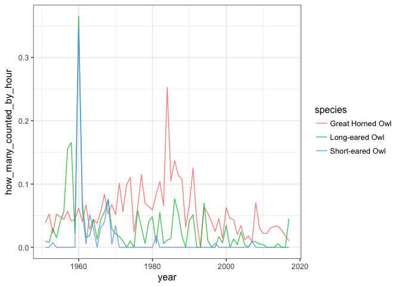

Christmas Birds
================
Zoë Wilkinson Saldaña
6/18/2019

This is a rough first draft at a Tidy Tuesday writeup\! Starting with
June 18th,
2019:

<https://github.com/rfordatascience/tidytuesday/tree/master/data/2019/2019-06-18>

``` r
library(tidyverse)
library(tidytext)
bird_counts <- readr::read_csv("https://raw.githubusercontent.com/rfordatascience/tidytuesday/master/data/2019/2019-06-18/bird_counts.csv")
```

``` r
head(bird_counts)
```

    ## # A tibble: 6 x 6
    ##    year species           species_latin       how_many_counted total_hours
    ##   <int> <chr>             <chr>                          <int>       <int>
    ## 1  1921 American Bittern  Botaurus lentigino…                0           8
    ## 2  1921 American Black D… Anas rubripes                      0           8
    ## 3  1921 American Coot     Fulica americana                   0           8
    ## 4  1921 American Crow     Corvus brachyrhync…                0           8
    ## 5  1921 American Goldfin… Spinus tristis                     0           8
    ## 6  1921 American Kestrel  Falco sparverius                   0           8
    ## # ... with 1 more variable: how_many_counted_by_hour <dbl>

``` r
tail(bird_counts)
```

    ## # A tibble: 6 x 6
    ##    year species             species_latin     how_many_counted total_hours
    ##   <int> <chr>               <chr>                        <int>       <int>
    ## 1  2017 Wilson's Warbler    Cardellina pusil…                0          NA
    ## 2  2017 Winter Wren         Troglodytes hiem…                9          NA
    ## 3  2017 Wood Duck           Aix sponsa                       1          NA
    ## 4  2017 Yellow-bellied Sap… Sphyrapicus vari…                4          NA
    ## 5  2017 Yellow-breasted Ch… Icteria virens                   0          NA
    ## 6  2017 Yellow-rumped Warb… Setophaga corona…                2          NA
    ## # ... with 1 more variable: how_many_counted_by_hour <dbl>

``` r
bird_counts %>%
  ggplot(aes(x=reorder(species, -how_many_counted), y=how_many_counted)) +
  geom_bar(stat="identity")
```

<!-- -->

``` r
major_birds <- bird_counts %>%
  filter(how_many_counted >= 100)

major_birds %>%
  ggplot(aes(x=reorder(species, -how_many_counted), y=how_many_counted)) +
  geom_bar(stat="identity")
```

<!-- -->

``` r
# duplicated(bird_counts$species)

bird_counts %>% 
  group_by(species) %>% 
  filter(n()>1) %>%
  summarise(count=n())
```

    ## # A tibble: 199 x 2
    ##    species                        count
    ##    <chr>                          <int>
    ##  1 American Bittern                  94
    ##  2 American Black Duck               94
    ##  3 American Coot                     94
    ##  4 American Crow                     94
    ##  5 American Goldfinch                94
    ##  6 American Kestrel                  94
    ##  7 American Pipit                    94
    ##  8 American Robin                    94
    ##  9 American Three-toed Woodpecker    94
    ## 10 American Tree Sparrow             94
    ## # ... with 189 more rows

``` r
# duplicated(bird_counts$species)

all_time_counts <- bird_counts %>% 
  group_by(species) %>% 
  summarise(all_years_count=sum(how_many_counted))


all_time_counts
```

    ## # A tibble: 199 x 2
    ##    species                        all_years_count
    ##    <chr>                                    <int>
    ##  1 American Bittern                             2
    ##  2 American Black Duck                      24549
    ##  3 American Coot                             2425
    ##  4 American Crow                           129099
    ##  5 American Goldfinch                       27963
    ##  6 American Kestrel                          1524
    ##  7 American Pipit                              12
    ##  8 American Robin                           16214
    ##  9 American Three-toed Woodpecker               2
    ## 10 American Tree Sparrow                    50600
    ## # ... with 189 more rows

``` r
all_time_counts %>%
  ggplot(aes(x=reorder(species, -all_years_count), y=all_years_count)) +
  geom_bar(stat="identity")
```

<!-- -->

``` r
top_birds <- all_time_counts %>%
  filter(all_years_count >= 100000)
```

``` r
bird_counts %>%
  filter(species %in% top_birds$species) %>%
  filter(year >= 1950) %>%
  ggplot(aes(x=year, y=how_many_counted_by_hour, colour = species)) +
  theme_bw(base_size = 12) +
  geom_point()
```

<!-- -->

``` r
rare_birds <- all_time_counts %>%
  filter(all_years_count < 1000 & all_years_count > 200)

bird_counts %>%
  filter(species %in% rare_birds$species) %>%
  filter(year >= 1950) %>%
  ggplot(aes(x=year, y=how_many_counted_by_hour, colour = species)) +
  theme_bw() +
  geom_line()
```

<!-- -->

``` r
bird_counts %>%
  filter(species %in% rare_birds$species) %>%
  filter(year >= 1950) %>%
  ggplot(aes(x=year, y=how_many_counted_by_hour, colour = species)) +
  theme_bw() +
  geom_point() +
  geom_text(size=3, aes(label=ifelse(how_many_counted_by_hour>0.4,as.character(species),'')),hjust=-0.1,vjust=0)
```

<!-- -->

``` r
bird_counts %>%
  filter(year >= 1950) %>%
  ggplot(aes(x=year, y=how_many_counted_by_hour)) +
  theme_bw(base_size = 12) +
  geom_point()
```

<!-- -->

``` r
bird_counts %>%
  filter(grepl('Owl', species)) %>%
  filter(year >= 1950) %>%
  ggplot(aes(x=year, y=how_many_counted_by_hour, colour=species)) +
  theme_bw(base_size = 12) +
  geom_line()
```

<!-- -->

``` r
bird_counts %>%
  filter(grepl('Owl', species)) %>%
  filter(year >= 1950) %>%
  ggplot(aes(x=year, y=how_many_counted_by_hour, colour=species)) +
  theme_bw(base_size = 12) +
  geom_point() +
  geom_text(size=3, aes(label=ifelse(how_many_counted_by_hour>0.15,as.character(species),'')),hjust=-0.1,vjust=0) +
  geom_line(alpha=0.3) +
  labs(title="Sightings of Owls in Hamilton, Ontario", x= "year", y ="sightings per person-hour observed")
```

<!-- -->

``` r
bird_counts %>%
  filter(year > 1950) %>%
  filter(species %in% c('Long-eared Owl', 'Short-eared Owl', 'Great Horned Owl', 'Eastern Screech Owl')) %>%
  ggplot(aes(x=year, y=how_many_counted_by_hour, colour=species)) +
  theme_bw(base_size = 12) +
  geom_line(alpha=0.8)
```

<!-- -->

``` r
bird_counts %>%
  ggplot(aes(x=year, y=how_many_counted)) +
  geom_col()
```

<!-- -->

``` r
bird_counts %>%
  filter(species %in% rare_birds$species) %>%
  ggplot(aes(x=year, y=how_many_counted)) +
  geom_point()
```

<!-- -->
