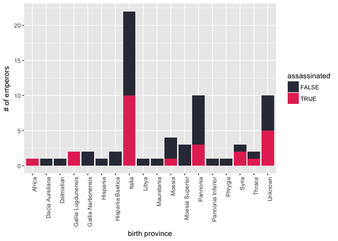

Emperors
================
Zoë Wilkinson Saldaña
8/13/2019

## Tidy Tuesday for 2019-08-13: Roman Emperors

This is a rough draft based on the following
data:

<https://github.com/rfordatascience/tidytuesday/tree/master/data/2019/2019-08-13>

Focusing on the theme of **assassinations**.

``` r
library(tidyverse)
library(scales)
library(corrr)
library(GGally)
library(lubridate)
emperors <- readr::read_csv("https://raw.githubusercontent.com/rfordatascience/tidytuesday/master/data/2019/2019-08-13/emperors.csv")
```

``` r
head(emperors)
```

    ## # A tibble: 6 x 16
    ##   index name  name_full birth      death      birth_cty birth_prv rise 
    ##   <int> <chr> <chr>     <date>     <date>     <chr>     <chr>     <chr>
    ## 1     1 Augu… IMPERATO… 0062-09-23 0014-08-19 Rome      Italia    Birt…
    ## 2     2 Tibe… TIBERIVS… 0041-11-16 0037-03-16 Rome      Italia    Birt…
    ## 3     3 Cali… GAIVS IV… 0012-08-31 0041-01-24 Antitum   Italia    Birt…
    ## 4     4 Clau… TIBERIVS… 0009-08-01 0054-10-13 Lugdunum  Gallia L… Birt…
    ## 5     5 Nero  NERO CLA… 0037-12-15 0068-06-09 Antitum   Italia    Birt…
    ## 6     6 Galba SERVIVS … 0002-12-24 0069-01-15 Terracina Italia    Seiz…
    ## # … with 8 more variables: reign_start <date>, reign_end <date>,
    ## #   cause <chr>, killer <chr>, dynasty <chr>, era <chr>, notes <chr>,
    ## #   verif_who <chr>

``` r
emperors %>%
  select(cause) %>%
  unique()
```

    ## # A tibble: 7 x 1
    ##   cause         
    ##   <chr>         
    ## 1 Assassination 
    ## 2 Suicide       
    ## 3 Natural Causes
    ## 4 Execution     
    ## 5 Died in Battle
    ## 6 Captivity     
    ## 7 Unknown

``` r
emperors <- emperors %>%
  mutate(assassinated = (cause == "Assassination"))
         
emperors %>%
  group_by(assassinated) %>%
  tally()
```

    ## # A tibble: 2 x 2
    ##   assassinated     n
    ##   <lgl>        <int>
    ## 1 FALSE           43
    ## 2 TRUE            25

``` r
# View(emperors)
```

``` r
cols <- hue_pal()(4)

orderlist = c("Julio-Claudian", "Flavian", "Nerva-Antonine",
               "Severan", "Gordian", "Constantinian", "Valentinian", "Theodosian") 

emperors_bar <- emperors %>%
  transform(dynasty = factor(dynasty, levels = orderlist)) 

emperors_bar %>%
  group_by(dynasty, assassinated) %>%
  tally() %>%
  ggplot(aes(x=dynasty, y=n, fill=assassinated)) +
  geom_bar(stat="identity") +
  scale_fill_manual(values= c("#333745", "#E63462")) + 
  theme(axis.text.x = element_text(angle = 90, hjust = 1))
```

<!-- -->

``` r
emperors %>%
  group_by(birth_cty, assassinated) %>%
  tally() %>%
  ggplot(aes(x=birth_cty, y=n, fill=assassinated)) +
  geom_bar(stat="identity") +
  scale_fill_manual(values= c("#333745", "#E63462")) + 
  theme(axis.text.x = element_text(angle = 90, hjust = 1))
```

<!-- -->

``` r
emperors <- emperors %>%
  mutate(age=interval(birth, death) / years(1))

# clumsy age repacement
# done manually here

emperors <- emperors %>%
  mutate(age=replace(age, name=="Augustus", 76)) %>%
  mutate(age=replace(age, name=="Tiberius", 51)) %>%
  mutate(age=replace(age, name=="Caligula", 53)) %>%
  mutate(age=replace(age, name=="Claudius", 63))


# View(emperors)

# historgram of age at death, binned by decade

emperors %>%
  ggplot(aes(age, fill = assassinated)) +
  geom_histogram(binwidth = 10, center = 4) +
  scale_fill_manual(values= c("#333745", "#E63462")) +
  xlab('age at death (by decade)') +
  ylab('# of emperors')
```

<!-- -->
